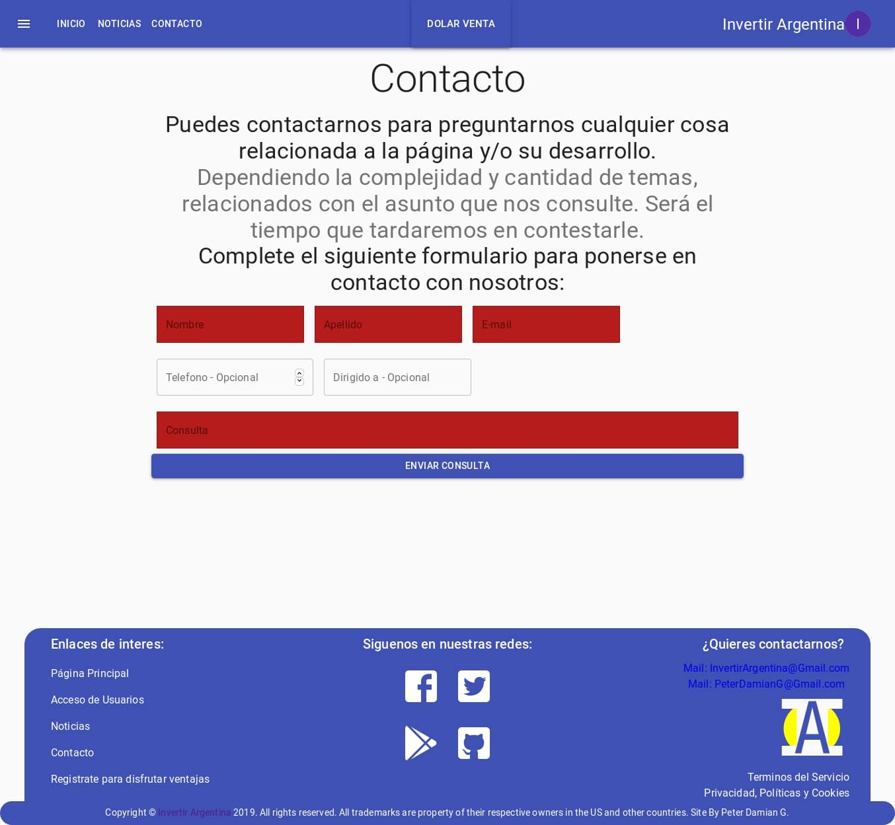

<h1 align="center">
  <br>
    
  <br>
  InvertirArgentina
  <br>
  <br>
</h1>
<h4 align="center">Una app web, demo sobre finanzas y economía.</h4>

----

### ¿Qué es esto?

Es una web de ejemplo o demo.
Página con temática sobre economía y finanzas. Con recolección de datos, sistema de registro y login, ordenamiento y comparación.

----

# Instalación - Uso

**Puedes Visitar la [Página de Testeo de Firebase](https://invertirargentina-cf94f.firebaseapp.com/), [Alternativa AppFirebase](https://invertirargentina-cf94f.web.app/) o [Alternativa GitHubPages](https://peterdamiang.github.io/InvertirArgentina/) donde se realiza el desarrollo.**
> En esas URL, se puede observar el funcionamiento de la webapp, en mínimo corriendo sobre las plataformas de Firebase y GitHubPages.

En caso de querer reformar el sistema o revisarlo más a gusto. Puedes clonar el repositorio o descargarlo para manejarlo.

Clonar:
```
$ git clone https://github.com/PeterDamianG/InvertirArgentina.git
```
Descarga:
[Branch Master](https://github.com/PeterDamianG/InvertirArgentina/archive/master.zip)

> Para configurar necesitaras conocimientos en React y Firebase.

----

### Configuración

Después de clonar o descargar el repositorio, en la correspondiente carpeta fuente o base. Se debe inicializar node y sus paquetes (Requerimos de node en su versión 10 o superior):

```
$ npm install
```

Cuando se termine de descargar y actualizar todos los modulos de node. Falta configurar el archivo de Firebase, que se encontrara en "carpetabase/src/components/Firebase.js":

```
const config = {
  apiKey: "EJEMPLO-ejemplo_23148-_eJempLo",
  authDomain: "paginaejemplo.firebaseapp.com",
  databaseURL: "https://paginaejemplo.firebaseio.com",
  projectId: "proyectoidejemplo",
  storageBucket: "paginaejemplo.appspot.com",
  messagingSenderId: "5123431424numeroejemplo",
  appId: "1:321111111:web:IDEjemplo",
  measurementId: "Ejemplo"
};
```

Luego de completar la configuración de Firebase, podemos montar el proyecto en modo desarrollo en nuestro entorno local, usando el siguiente comando:

```
$ npm start
```

El entorno de pruebas/desarrollo se montara en [LOCALHOST](http://localhost:3000/), lo mismo http://localhost:3000/.

Ya podrá probarlo en su propio entorno.

----

## Screenshots - Imágenes
Imágenes reducidas para mejor manejo del Readme, si deseas revisar las originales ve a: [Imágenes](https://github.com/PeterDamianG/InvertirArgentina/tree/master/screenshots)

*Screenshot de la Home/Inicio sin estar logeado:*


*Screenshot de la Home/Inicio estando logeado:*


*Screenshot de Noticias:*


*Screenshot de sección Noticias ejemplo:*


*Screenshot de Contacto sin estar login:*


*Screenshot de Contacto estando logeado:*


*Screenshot de Barras Dolar:*


*Screenshot de Tabla Dolar:*


*Screenshot del Login:*


*Screenshot del Registro:*


*Screenshot del Perfil:*


----

### Registro de Cambios y Problemas

**Importante: En GitHub Pages, el redireccionamiento nos manda a la página de error, sólo ocurre bajo el sistema de GitHub Pages. En entornos privados, publico y Firebase Hosting, no existe este problema.**

*Para más información dirigirse al registro de cambios*
[Registro de Cambios y Problemas](CHANGELOGS.md)

----

#### Tecnologías utilizadas

- HTML 5
- CSS
- Javascript
- NodeJS
- React (React-Hook)
- Firebase
- Material-UI

----

##### Gracias a

- La página oficial de Datos.gob.ar, por su servicios brindados.
- Todos los legítimos dueños de las tecnologías de código libres/privadas utilizadas.

----

##### MIT license
Copyright (c) 2019 Peter DG

Permission is hereby granted, free of charge, to any person obtaining a copy of this software and associated documentation files (the "Software"), to deal in the Software without restriction, including without limitation the rights to use, copy, modify, merge, publish, distribute, sublicense, and/or sell copies of the Software, and to permit persons to whom the Software is furnished to do so, subject to the following conditions:

The above copyright notice and this permission notice shall be included in all copies or substantial portions of the Software.

THE SOFTWARE IS PROVIDED "AS IS", WITHOUT WARRANTY OF ANY KIND, EXPRESS OR IMPLIED, INCLUDING BUT NOT LIMITED TO THE WARRANTIES OF MERCHANTABILITY, FITNESS FOR A PARTICULAR PURPOSE AND NONINFRINGEMENT. IN NO EVENT SHALL THE AUTHORS OR COPYRIGHT HOLDERS BE LIABLE FOR ANY CLAIM, DAMAGES OR OTHER LIABILITY, WHETHER IN AN ACTION OF CONTRACT, TORT OR OTHERWISE, ARISING FROM, OUT OF OR IN CONNECTION WITH THE SOFTWARE OR THE USE OR OTHER DEALINGS IN THE SOFTWARE. 

-------------------------------------------------------------------------------------------------------------
© CopyRight 2019. All rights reserved. All trademarks belong to their respective owners in the USA an another countries. and other countries. Not affiliated with government or another organization.
_____________________________________________________________________________________________________________

Copyright (c) 2019 Peter DG

Se concede permiso, libre de cargos, a cualquier persona que obtenga una copia de este software y de los archivos de documentación asociados (el "Software"), para utilizar el Software sin restricción, incluyendo sin limitación los derechos a usar, copiar, modificar, fusionar, publicar, distribuir, sublicenciar, y/o vender copias del Software, y a permitir a las personas a las que se les proporcione el Software a hacer lo mismo, sujeto a las siguientes condiciones:

El aviso de copyright anterior y este aviso de permiso se incluirán en todas las copias o partes sustanciales del Software.

EL SOFTWARE SE PROPORCIONA "TAL CUAL", SIN GARANTÍA DE NINGÚN TIPO, EXPRESA O IMPLÍCITA, INCLUYENDO PERO NO LIMITADA A GARANTÍAS DE COMERCIALIZACIÓN, IDONEIDAD PARA UN PROPÓSITO PARTICULAR Y NO INFRACCIÓN. EN NINGÚN CASO LOS AUTORES O PROPIETARIOS DE LOS DERECHOS DE AUTOR SERÁN RESPONSABLES DE NINGUNA RECLAMACIÓN, DAÑOS U OTRAS RESPONSABILIDADES, YA SEA EN UNA ACCIÓN DE CONTRATO, AGRAVIO O CUALQUIER OTRO MOTIVO, DERIVADAS DE, FUERA DE O EN CONEXIÓN CON EL SOFTWARE O SU USO U OTRO TIPO DE ACCIONES EN EL SOFTWARE. 

-------------------------------------------------------------------------------------------------------------
© CopyRight 2019. Todos los derechos reservados. Todas las marcas registradas pertenecen a sus respectivos dueños en EE. UU. y otros países. No afiliado con gobiernos, no-gobiernos u otras organizaciones.
